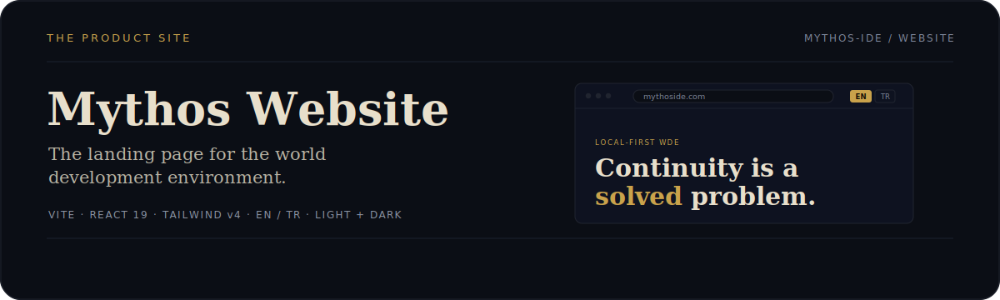

<div align="center">
  
</div>

# Mythos Website (`mythoside-website`)

[](./LICENSE)

<p align="center"><a href="./README.md">English</a> · Türkçe</p>

<p align="center">
  <a href="https://github.com/Mythos-IDE">Ekosistem</a>
  &nbsp;·&nbsp;
  <a href="https://github.com/Mythos-IDE/mythoside-core">Çekirdek motor</a>
  &nbsp;·&nbsp;
  <a href="https://github.com/Mythos-IDE/mythoside-ts">Masaüstü uygulaması</a>
</p>

**Mythos**'nin resmi tanıtım sayfası — romancılar için yerel-öncelikli dünya geliştirme ortamı. Ürün hikâyesini anlatır: tüm bir seriyi bir derleyicinin kod tabanını okuduğu gibi okumak, böylece süreklilik hataları bir okur bulmadan önce yüzeye çıkar.

Ürünün kendisiyle aynı editoryal kimlikte tek sayfalık bir React uygulaması olarak inşa edildi — mürekkep-ve-altın, monospace bir arayüz üzerinde serif bir başlık yüzü, İngilizce ve Türkçe içerik, açık ve koyu temalar.

## Teknoloji Yığını

| Katman | Araçlar |
| --- | --- |
| Build | Vite |
| Arayüz | React 19, TypeScript |
| Stil | Özel tasarım token'larıyla Tailwind CSS v4 |
| Çoklu dil | Yerleşik EN / TR geçişi (çalışma zamanı bağımlılığı yok) |
| Tema | Açık + koyu, sistem tercihini izler, seçimi hatırlar |

## Yerelde Çalıştırma

```bash
git clone https://github.com/Mythos-IDE/mythoside-website.git
cd mythoside-website
npm install
npm run dev
```

Vite siteyi `http://localhost:5173` adresinde sunar. Üretim derlemesi için `npm run build`.

## Proje Yapısı

```text
src/index.css              tasarım token'ları (mürekkep-ve-altın), açık/koyu tema
src/i18n.tsx               EN / TR sözlüğü ve dil geçişi
src/theme.tsx              tema context'i ve geçişi
src/components/sections/   Hero, Problem, Model, Engine, Ethos, Pricing, Footer
src/components/ui/         paylaşılan bileşenler (FadeIn, Logo)
```

## Lisans

MIT — [LICENSE](./LICENSE) dosyasına bakın. (`mythoside-core` motoru ve `mythoside-ts` uygulaması FSL-1.1 kapsamındadır; web sitesi MIT'tir.)
